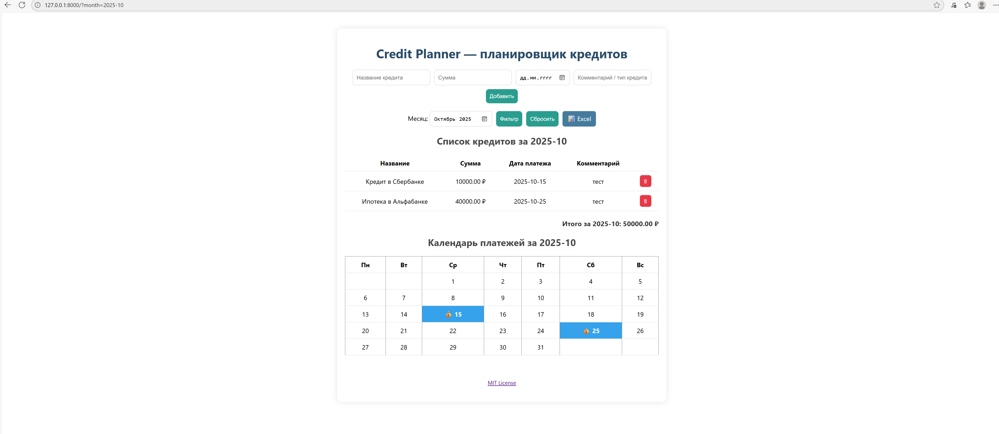

#  Credit Planner

Веб-приложение на FastAPI для учёта кредитов и планирования платежей.  
Позволяет добавлять кредиты, отслеживать платежи по месяцам, просматривать календарь платежей и экспортировать данные в Excel.

 
 
---

##  Возможности

- Добавление и удаление кредитов  
- Фильтр по месяцу  
- Подсчёт общей суммы платежей за выбранный месяц  
- Визуальный календарь платежей  
- Экспорт данных в Excel (`.xlsx`)  
- Хранение данных в SQLite (автоматически создаётся)
---

##  Стек технологий

- [FastAPI](https://fastapi.tiangolo.com/)
- [Jinja2](https://jinja.palletsprojects.com/)
- [SQLite3](https://www.sqlite.org/)
- [Pandas](https://pandas.pydata.org/)
- [OpenPyXL](https://openpyxl.readthedocs.io/)
- [HTML + CSS (Jinja-шаблоны)](https://jinja.palletsprojects.com/)  

## Установка и запуск

1. Установить зависимости:

###
    pip install -r requirements.txt

2. Запустить приложение:

###
    uvicorn main:app --reload

3. Открыть в браузере: http://127.0.0.1:8000/

4. Swagger: http://127.0.0.1:8000/docs

Этот проект распространяется под лицензией MIT.
Подробности см. в файле [LICENSE](./LICENSE).
